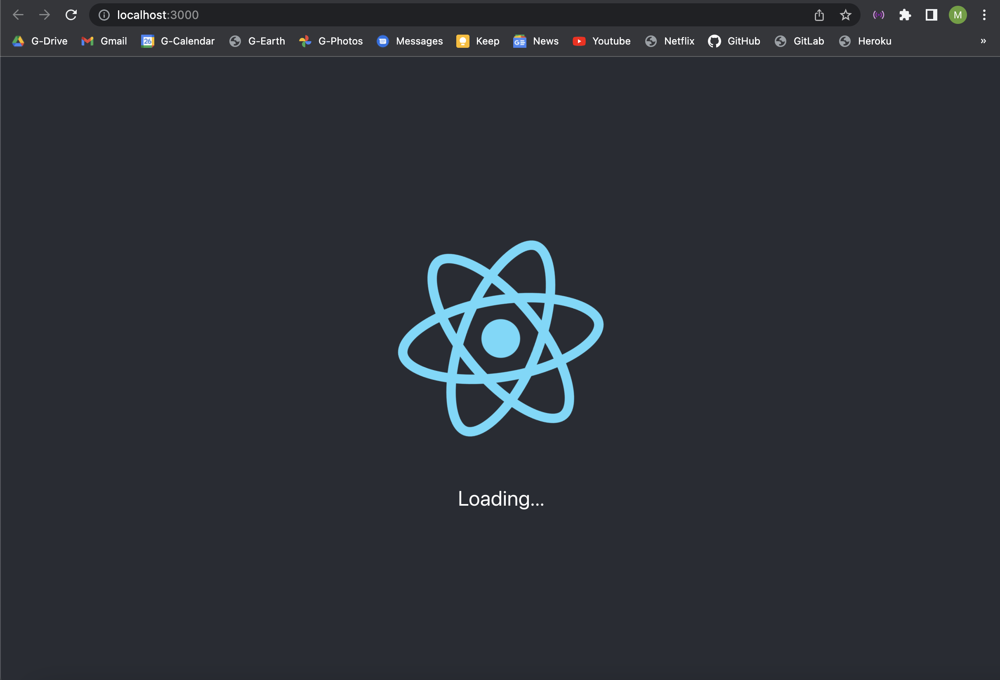
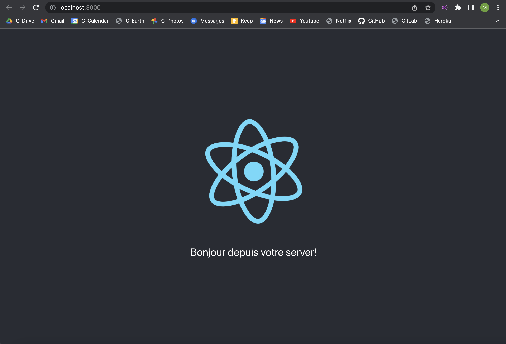

# Minimal-Fullstack-application
Minimal fullstack application built with Node.js and React.js .

### Built With

* [![Node][Node.js]](https://nodejs.org/fr/download/)
* [![Express][Express.js]](https://expressjs.com/fr/)
* [![React][React.js]](https://reactjs.org/)

## Résultats:
* npm start sans avoir démarré le serveur:

* serveur démarré:
